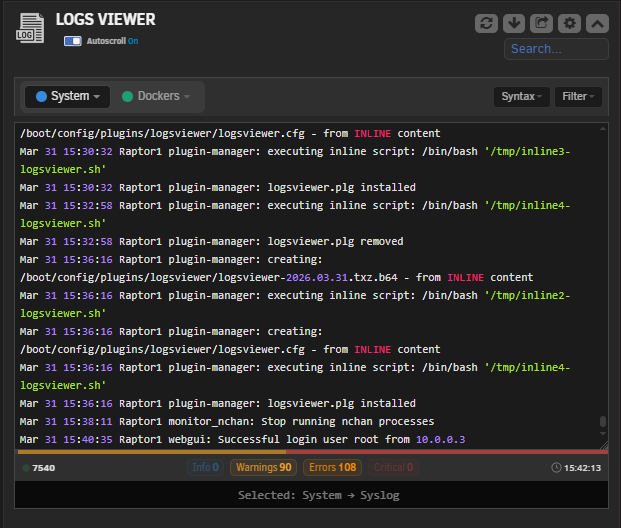
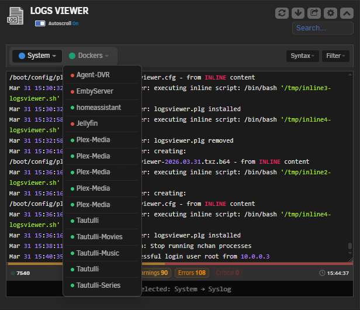
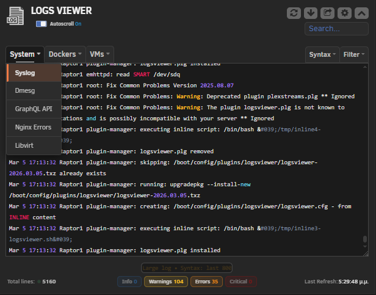
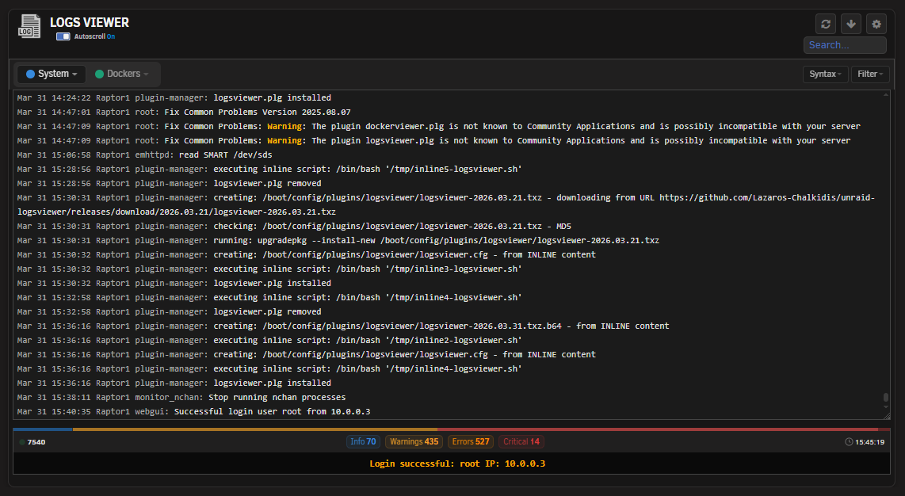
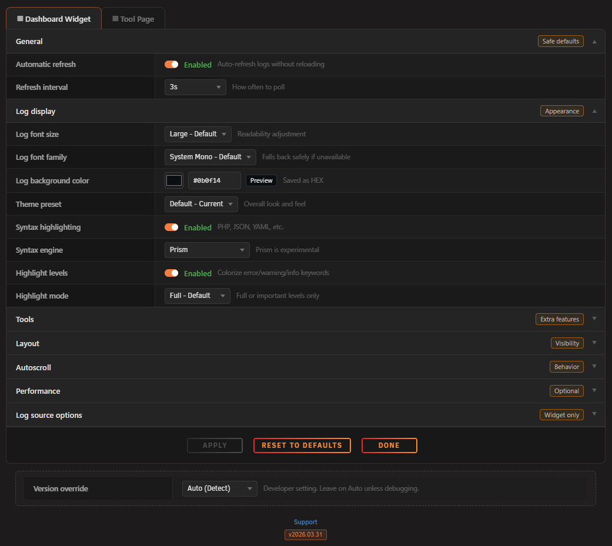
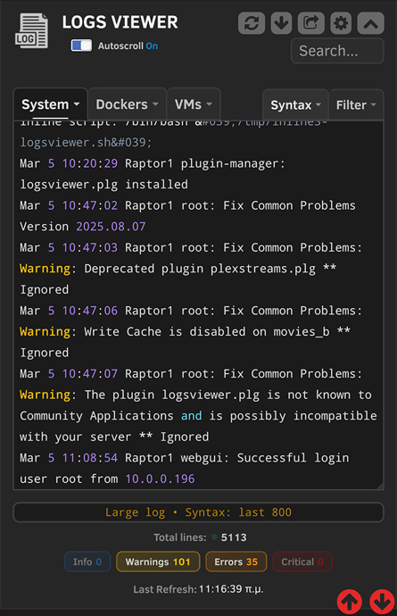
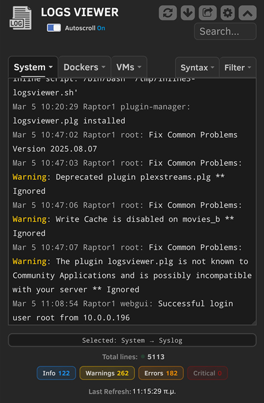
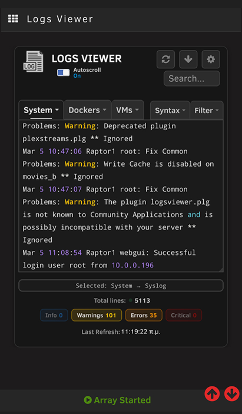
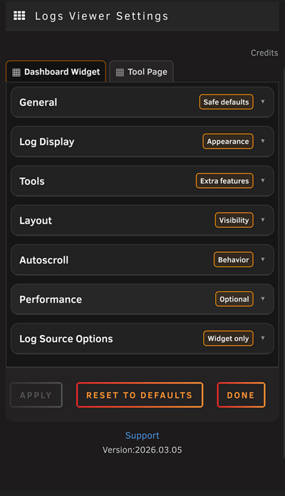
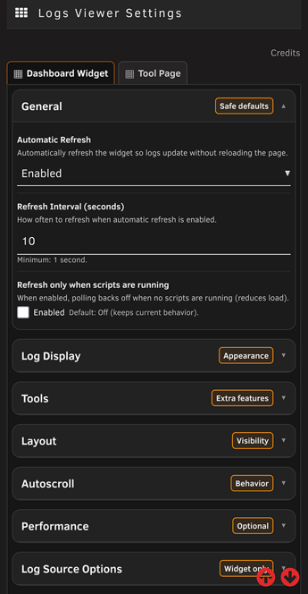

# Logs Viewer for Unraid

A modern, fast and feature rich log viewer plugin for Unraid. View System, Docker and VM logs directly from your dashboard or a dedicated Tools page. No terminal required.

---

## ✨ Features

- **Dashboard Widget**: Monitor logs in real-time directly from the Unraid dashboard
- **Tools Page**: Full-screen log viewer for a more focused experience
- **System Logs**: Syslog, Dmesg, GraphQL API, Nginx Errors, Libvirt and more
- **Docker Logs**: View logs from any Docker container
- **VM Logs**: View logs from any Virtual Machine
- **Search**: Real-time search with match highlighting and navigation (next/prev)
- **Filtering**: Filter by log level: Errors, Warnings, Info
- **Syntax Highlighting**: Two engines supported: Highlight.js and Prism.js
- **Autoscroll**: Automatically follow new log entries as they arrive
- **Export**: Export logs as `.log`, `.txt` or structured `.json`
- **Status Badges**: At-a-glance counters for Errors, Warnings and Info entries
- **Mobile Responsive**: Works on all screen sizes
- **Performance Friendly**: Smart limits for large logs, debounced search, DOM caching
- **Resizable Widget**: Adjustable height for the dashboard widget and tool

---

## 📦 Installation

### Via Community Applications (recommend)
1. Open **Community Applications** in Unraid
2. Search for **Logs Viewer**
3. Click **Install**

### Manual Installation
1. Go to **Plugins** in Unraid
2. Click **Install Plugin**
3. Paste the following URL:
```
https://raw.githubusercontent.com/Lazaros-Chalkidis/unraid-logsviewer/main/logsviewer.plg
```
4. Click **Install**

---

## ⚙️ Configuration

After installation, go to **Settings → Logs Viewer** to configure:

The Dashboard Widget and the Tool Page have independent settings each can be configured separately to suit different use cases.

| Setting | Description |
|---------|-------------|
| Auto Refresh | Enable/disable automatic log refresh |
| Refresh Interval | How often to refresh (in seconds) |
| Tail Lines | Limit the number of lines displayed |
| Font Size & Family | Customize the log display font |
| Syntax Highlighting | Choose engine: Highlight.js or Prism.js(beta) |
| Search | Enable in log search |
| Export Format | Choose default export format (.log / .txt / .json) |
| Log Sources | Choose which System logs, Docker containers and VMs to show |
- And more...

---

## 🔄 Log Sources

### System Logs
- Syslog (`/var/log/syslog`)
- Dmesg (kernel ring buffer)
- Nginx Errors
- GraphQL API log
- Libvirt
- And more...

### Docker Logs
Automatically discovers all Docker containers on your system. Select which ones to monitor.

### VM Logs
Automatically discovers all Virtual Machines. Select which ones to monitor.

---

## 📤 Export Formats

| Format | Description |
|--------|-------------|
| `.log` | Plain text log file |
| `.txt` | Plain text file |
| `.json` | Structured JSON with parsed timestamp, level, hostname and service per line |

---

## 🔒 Security

- CSRF token protection on all API requests¹
- Rate limiting (60 requests/minute per IP)
- Origin validation — blocks cross-origin requests
- Input validation with length limits on all parameters
- Security headers on all API responses
- MD5 package integrity verification on install

File & Directory Permissions:
- Plugin directory: 755 (rwxr-xr-x)
- PHP files: 644 (rw-r--r--) 
- Page files: 644 (rw-r--r--) 
- Static assets (JS, CSS, PNG): 644 (rw-r--r--) 
- Config file (/boot/config/plugins/logsviewer/logsviewer.cfg): 600 (rw-------) 
- Config directory (/boot/config/plugins/logsviewer/): 700 (rwx------) 
- Cache directory (/tmp/logsviewer_cache/): 700 (rwx------) 
- No world-writable files (verified with find -perm -002)

¹ Uses a custom nonce implementation (hourly rotation, stored in /tmp) instead of Unraid's built in $var['csrf_token']. 
Both approaches are valid, this was a deliberate choice to keep the API self-contained.

---

## 📸 Screenshots

### Dashboard Widget PC Screen




### Tool Page PC Screen


### Settings Page PC Screen


### Dashboard Widget Mobile Screen



### Tool Page Mobile Screen


### Settings Page Mobile Screen



---

## 🛠️ Development

### Requirements
- Unraid 7.2.0 or later
- Bash (for build script)

### Build
```bash
# Release build
./build.sh

# Dev build
./build.sh "" dev

# Local build (embedded package, no internet required)
./build.sh "" "" local
```

### Project Structure
```
unraid-logsviewer/
├── source/
│   ├── css/                        # Stylesheets
│   ├── js/                         # JavaScript
│   ├── Logsviewer.page             # Dashboard widget
│   ├── LogsviewerTool.page         # Tools page
│   ├── LogsviewerSettings.page     # Settings page
│   └── logsviewer_api.php          # Backend API
├── screenshots/
│   ├── pc/                         # PC screenshots
│   └── mobile/                     # Mobile screenshots
├── build.sh                        # Build script
├── CHANGELOG.md                    # Version history
├── logsviewer.plg                  # Plugin definition
└── logsviewer.xml                  # CA metadata
```

---

## 📋 Changelog

See [CHANGELOG.md](CHANGELOG.md) for version history.

---

## 🐛 Issues & Support

If you'd like to suggest new features, report a bug, or have any feedback, feel free to open an issue on 
[GitHub](https://github.com/Lazaros-Chalkidis/unraid-logsviewer/issues) 
or post on the 
[Unraid Forum](https://forums.unraid.net/topic/197621-plugin-logs-viewer-real-time-log-viewer-dashboard-widget-for-unraid/).

---

## 👤 Author

**Lazaros Chalkidis**
- GitHub: [@Lazaros-Chalkidis](https://github.com/Lazaros-Chalkidis)

---

## 📄 License

Copyright (C) 2026 Logs Viewer Unraid Plugin - Lazaros Chalkidis

Licensed under the GNU General Public License v3.0 or later (GPL-3.0-or-later).
See the `LICENSE` file for the full license text.
