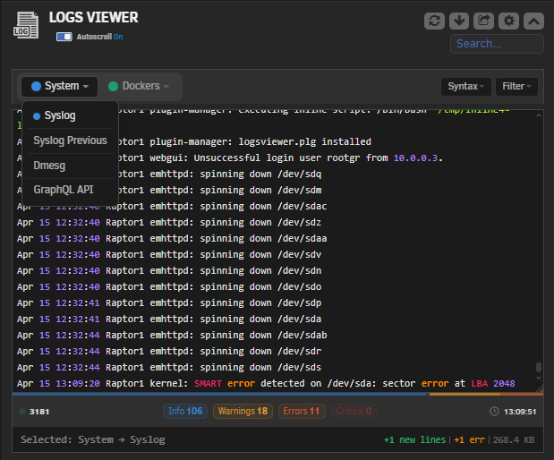
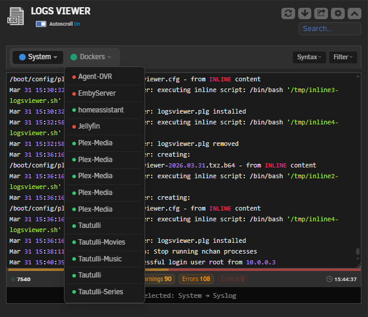
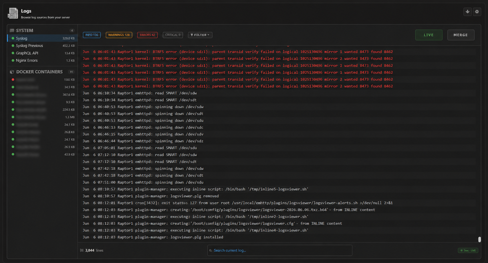
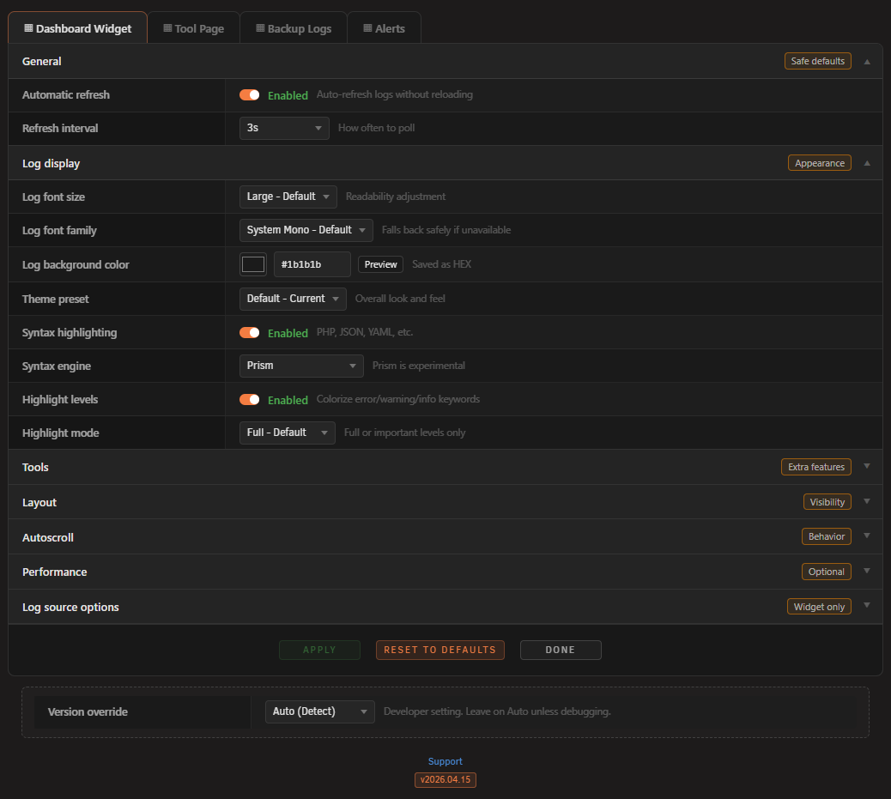

# Logs Viewer for Unraid

Real-time system, Docker, VM and User Scripts log viewer with dashboard widget and dedicated Tools page. Log backups and system alerts.
Live auto-refresh, severity badges, search, filtering, syntax highlighting and export.

<p align="center">
  &nbsp;
  &nbsp;
  &nbsp;
  &nbsp
  
</p>

## Features

- **Dashboard Widget** with live auto-refresh and severity proportion strip
- **Tools Page** for full-screen, focused log viewing
- **System Logs**: Syslog, Syslog Previous, Dmesg, GraphQL API, Nginx Errors, PHP Log, Libvirt
- **Docker Logs** with real-time running/stopped status indicators
- **VM Logs** with real-time running/stopped status indicators
- **User Scripts Logs**: finds the scripts in the User Scripts plugin and shows their output, no paths to type in
- **Custom Logs**: point the plugin at any log file under `/var/log`, `/mnt/user` or `/mnt/cache` and it shows up everywhere
- **Log Backups**: scheduled snapshots of every source you enable, daily or every 2 to 4 days, compressed to a path you choose, with retention control and calendar download
- **Alerts**: pattern-based rules that scan logs every 1/2/5 minutes and push notifications through Unraid's notification system when a match is found. Includes one-click presets for failed logins, disk errors, OOM, kernel panics, array errors and Docker crashes
- **Search**: match highlighting with next/prev navigation
- **Filtering**: by severity level (Info, Warnings, Errors, Critical) or login events
- **Severity Badges**: clickable counters that double as quick filters
- **Proportion Strip**: color bar in the footer showing the error/warning/info ratio at a glance
- **Syntax Highlighting**: Highlight.js and Prism.js bundled locally, no CDN calls
- **Fonts**: system monospace by default. The four named fonts are optional and load from Google Fonts, falling back to your system monospace if the server has no internet access
- **Autoscroll**: follows new entries as they arrive, with pause-on-hover option
- **Export**: `.log`, `.txt`, `.json` or `.csv`, with parsed timestamps and levels in the structured formats
- **Responsive**: works from wide monitors down to phones
- **Theme Support**: Black, Gray, Azure and White
- **Independent Settings**: Dashboard widget and Tool page configured separately
- **Performance Friendly**: single-source polling, content hash detection, pre-compiled regex, smart tail limits

### Dashboard Widget PC Screen



### Tool Page PC Screen


## Installation

### Community Applications (recommended)
1. Open **Community Applications** in Unraid
2. Search for **Logs Viewer**
3. Click **Install**

### Manual
1. Go to **Plugins** in Unraid
2. Click **Install Plugin**
3. Paste the URL:
```
https://raw.githubusercontent.com/Lazaros-Chalkidis/unraid-logsviewer/main/logsviewer.plg
```
4. Click **Install**

## Configuration

Go to **Settings → Logs Viewer** after installing. Four tabs: Dashboard, Tool, Backup and Alerts, each with their own settings.
The full-screen viewer lives under **Tools → Viewers Suite → Logs Viewer**.

| Setting | What it does |
|---------|-------------|
| Auto Refresh | Enable/disable live polling |
| Refresh Interval | Poll frequency in seconds |
| Tail Lines | Cap the number of lines shown |
| Font Size & Family | Adjust log readability (default: Large) |
| Theme Preset | Color scheme for the log panel (Default, Terminal, Dim, High Contrast, Midnight, Ocean, Monokai) |
| Syntax Highlighting | Pick Highlight.js or Prism.js |
| Search | Enable in-log search with highlighting |
| Filter Dropdown | Quick severity filter in the tabs rail |
| Badges / Timestamp / Toast | Toggle individual footer elements |
| Export Format | Default format for downloads (.log / .txt / .json, plus .csv on the Tool page) |
| Log Sources | Choose which System logs, Docker containers, VMs, user scripts and custom logs to show |
| Custom Log Paths | Add your own log files, shared across all four tabs |
| Backup Enabled | Turn scheduled backups on/off |
| Backup Schedule | Time of day the backup runs |
| Backup Frequency | Every day, or every 2, 3 or 4 days |
| Backup Storage | Path where backup archives are stored |
| Backup Retention | How many months of backups to keep (1 to 6) |
| Alerts Enabled | Turn log scanning on/off |
| Alerts Interval | How often the scanner runs (1, 2 or 5 minutes) |
| Alert Rules | Add, edit or remove pattern-based rules with severity, sources and cooldown |

## Log Sources

### System Logs
Syslog, Syslog Previous, Dmesg, Nginx Errors, GraphQL API, PHP Log, Libvirt. Selectable per page.

### Docker Logs
Automatically discovers all containers. Each entry shows a green or red dot for running/stopped state. Select which ones to monitor.

### VM Logs
Automatically discovers all VMs. Same status dots. Select which ones to monitor.

### User Scripts Logs
Reads the scripts installed in the User Scripts plugin and lists them with a checkbox. The log is the one User Scripts itself keeps, so it appears after a script has run in the background or on a schedule. A run started with **Run Script** streams to the browser and leaves no file behind. The section is hidden when User Scripts is not installed.

### Custom Logs
Add any log file under `/var/log`, `/mnt/user` or `/mnt/cache`. Paths are defined once and are then available on the Tool page, the widget, Alerts and Backup.

## Log Backups

Compressed backups of the log sources you enable (system, Docker, VMs, user scripts, custom) to a storage path of your choice.

Settings include:
- Backup time (configurable hour)
- Backup frequency: every day, or every 2, 3 or 4 days
- Storage path (defaults to `/mnt/user/appdata/Logs-Viewer-Backup`)
- Retention from 1 to 6 months, with automatic cleanup of older backups
- Calendar view in the Settings page showing available dates
- One-click ZIP download for any backup date

Backup directories are created with restricted permissions (700) so they are not exposed through Samba shares.

## Alerts

The alert system scans log sources at regular intervals and sends notifications through Unraid's built-in notification system when a pattern match is found.

**How it works:**
- Define rules with a name, text or regex pattern, target sources and severity level. Any source can be targeted, including user script and custom logs
- Set a cooldown per rule to avoid repeated notifications for the same event
- The scanner runs as a cron job every 1, 2 or 5 minutes depending on your setting
- Matches are logged in the alert history (visible in the Settings page) and pushed as Unraid notifications

**Built-in presets (one click):**
- Failed Login (syslog)
- Disk Error (syslog, dmesg)
- Out of Memory (syslog, dmesg)
- Kernel Panic (syslog, dmesg)
- Array Error (syslog)
- Docker Crash (docker logs)

You can add your own rules on top of these.

## Export Formats

| Format | Description |
|--------|-------------|
| `.log` | Plain text |
| `.txt` | Plain text |
| `.json` | Structured: parsed timestamp, level, hostname and service per line |
| `.csv` | Same fields as JSON, one row per line (Tool page) |

### Settings Page PC Screen


## Development

### Requirements
- Unraid 7.2.0 or later
- Bash (for the build script)

### Build
```bash
./build.sh                  # release
./build.sh "" dev           # dev build
./build.sh "" "" local      # local build (embedded package, no internet)
```

### Project Structure
```
unraid-logsviewer/
├── source/
│   ├── css/                        # widget.css, tool.css, tool-logs.css, settings.css
│   ├── js/                         # widget and tool page scripts
│   ├── include/                    # api endpoint, alert scanner, tool page partials
│   ├── vendor/                     # hljs + prism (local bundles)
│   ├── Logsviewer.page             # Dashboard widget
│   ├── LogsviewerTool.page         # Tools page
│   ├── LogsviewerSettings.page     # Settings page
│   ├── logsviewer-alerts.sh        # Alert scanner cron wrapper
│   └── logsviewer-backup.sh        # Backup cron wrapper
├── screenshots/
├── build.sh
├── CHANGELOG.md
├── logsviewer.plg
└── logsviewer.xml
```

## Changelog

See [CHANGELOG.md](CHANGELOG.md)

## Support

Bug reports, feature requests or general feedback:
- [GitHub Issues](https://github.com/Lazaros-Chalkidis/unraid-logsviewer/issues)

## Author

**Lazaros Chalkidis** - [@Lazaros-Chalkidis](https://github.com/Lazaros-Chalkidis)

## License

Copyright (C) 2026 Logs Viewer Unraid Plugin - Lazaros Chalkidis

Licensed under the GNU General Public License v3.0 or later (GPL-3.0-or-later).
See the `LICENSE` file for the full text.
